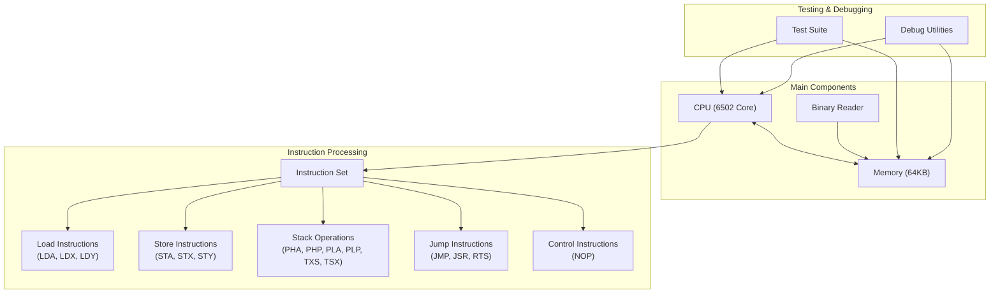
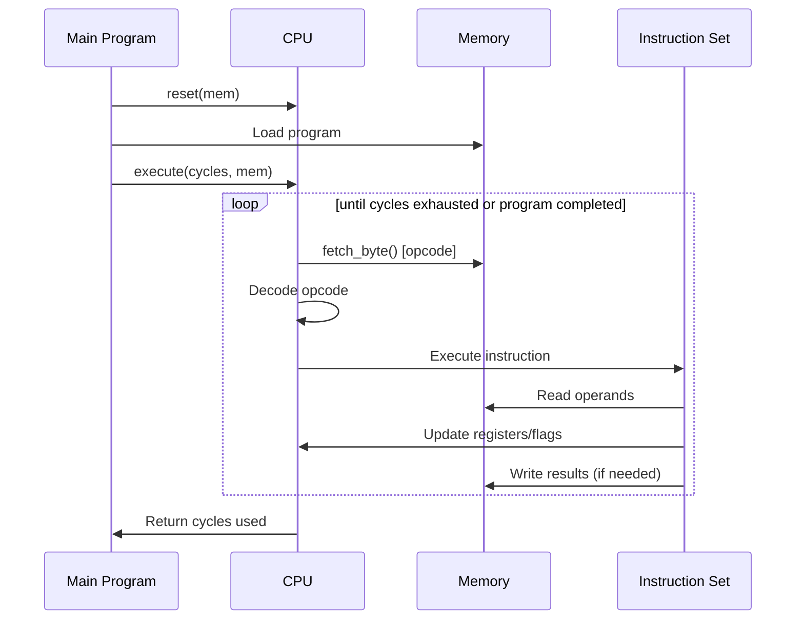
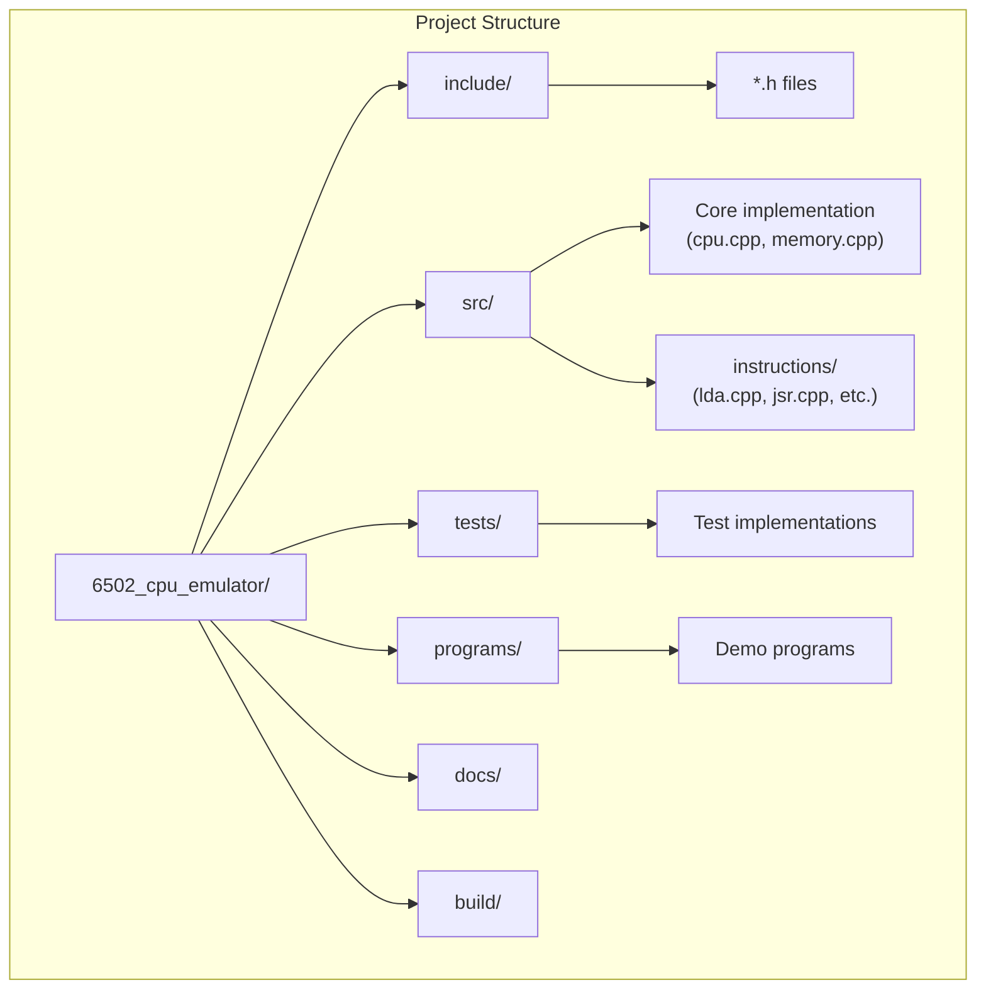

# 6502 CPU Emulator Architecture

This document describes the high-level architecture of the 6502 CPU emulator and how its components interact.

## System Architecture Overview

The emulator is designed with a modular architecture that closely models the actual hardware components of a 6502-based system.

## Component Interactions

### Core Execution Flow

## File Organization

The project is organized into the following directory structure:

## Key Components

### CPU Class

The `Cpu` class is the core of the emulator, responsible for:

- Managing CPU registers (A, X, Y, PC, SP)
- Maintaining processor status flags (C, Z, I, D, B, V, N)
- Fetching, decoding, and executing instructions
- Tracking execution cycles

### Memory Class

The `Mem` class represents the 64KB memory space and provides:

- Memory initialization
- Read/write operations at byte and word level
- Special handling for different memory regions

### Instruction Implementation

Instructions are implemented as standalone functions grouped by type:

- Each function handles a specific instruction with a specific addressing mode
- Functions receive the CPU, memory, and cycle counter as parameters
- They perform the operation and update registers, flags, and cycle count

### Binary Reader

The `binary_reader` namespace provides utilities to:

- Load programs into memory from binary files
- Initialize memory with predefined program data
- Map memory regions for efficient memory usage

## Execution Model

The emulator uses a cycle-based execution model:

1. The main program allocates a specific number of CPU cycles
2. The CPU executes instructions until cycles are exhausted or execution is complete
3. The CPU returns the number of cycles actually used

This cycle-accurate approach allows the emulator to:

- Maintain proper timing between instructions
- Support cycle-stealing effects when crossing page boundaries
- Provide accurate performance metrics

## Testing Framework

The project includes a comprehensive testing framework to:

- Validate individual instructions and addressing modes
- Test edge cases like page boundary crossings
- Ensure accurate emulation of the 6502 behavior

## Extending the Architecture

To add new instructions to the emulator:

1. Define the opcode in `op_codes.h`
2. Implement the instruction function in the appropriate file in `src/instructions/`
3. Add the instruction handler to the switch statement in `cpu.cpp`
4. Create unit tests in the `tests/` directory

## Related Documentation

- [CPU Implementation](CPU.md) - Detailed CPU implementation
- [Memory Organization](MEMORY.md) - Memory structure and access patterns
- [Instruction Set](OPCODES.md) - Supported instructions and addressing modes
- [Demo Programs](DEMO_PROGRAMS.md) - Example programs and usage
