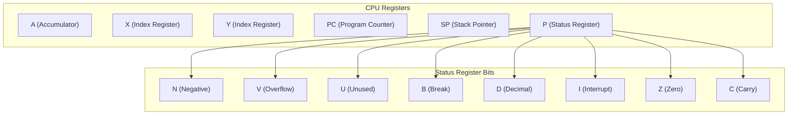
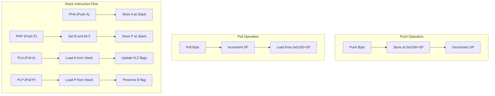

# 6502 CPU Implementation

The 6502 processor is an 8-bit microprocessor with a 16-bit address bus, allowing it to address 64KB of memory. This document describes the implementation details of the 6502 CPU in our emulator.

## Registers

The 6502 has a minimal but effective register set. Our implementation follows the original hardware closely.

| Register | Size   | Description                                                                   |
| -------- | ------ | ----------------------------------------------------------------------------- |
| A        | 8-bit  | Accumulator - Primary register for arithmetic and logic operations            |
| X        | 8-bit  | X Index Register - Used for indexing and counters                             |
| Y        | 8-bit  | Y Index Register - Used for indexing and counters                             |
| PC       | 16-bit | Program Counter - Points to the next instruction to execute                   |
| SP       | 8-bit  | Stack Pointer - Points to the next free location on the stack (0x0100-0x01FF) |
| P        | 8-bit  | Processor Status - Contains status flags                                      |

## Status Flags (P Register)

The status register contains several single-bit flags that control or reflect the CPU state.

| Bit | Flag              | Symbol | Description                                                         |
| --- | ----------------- | ------ | ------------------------------------------------------------------- |
| 7   | Negative          | N      | Set if the result of the last operation has bit 7 set (is negative) |
| 6   | Overflow          | V      | Set if the last operation caused a signed arithmetic overflow       |
| 5   | Unused            | U      | Not used, typically set to 1                                        |
| 4   | Break             | B      | Set when BRK instruction is executed                                |
| 3   | Decimal           | D      | Set when processor is in BCD (Binary Coded Decimal) mode            |
| 2   | Interrupt Disable | I      | Set when interrupts are disabled                                    |
| 1   | Zero              | Z      | Set if the result of the last operation was zero                    |
| 0   | Carry             | C      | Set if the last operation resulted in a carry or during shifts      |

## CPU Register Representation



## Stack Operations

The 6502 has a fixed 256-byte stack located in page 1 of memory (addresses 0x0100 to 0x01FF). The stack pointer is 8 bits and points to the next free location on the stack. The stack grows downward in memory.

### Stack Pointer Operations

- On reset, SP is initialized to 0xFF (stack address 0x01FF)
- When pushing a byte onto the stack:
    1. The byte is stored at the address (0x0100 + SP)
    2. SP is decremented
- When pulling a byte from the stack:
    1. SP is incremented
    2. The byte is read from address (0x0100 + SP)

### Stack-Related Instructions

The emulator implements the following stack operations:

| Instruction | Description                 | Flags Affected |
| ----------- | --------------------------- | -------------- |
| PHA         | Push Accumulator            | None           |
| PHP         | Push Processor Status       | None           |
| PLA         | Pull Accumulator            | N, Z           |
| PLP         | Pull Processor Status       | All            |
| TXS         | Transfer X to Stack Pointer | None           |
| TSX         | Transfer Stack Pointer to X | N, Z           |

### Status Flag Handling

- When executing PHP (Push Processor Status), the status register is pushed to the stack with the Break flag (B) and bit 5 set to 1
- When executing PLP (Pull Processor Status), the status register is restored from the stack, but the Break flag is not changed

### 16-bit Value Handling

For 16-bit values (like addresses for JSR/RTS):

- The high byte is pushed first, then the low byte
- The low byte is pulled first, then the high byte



## Emulator Implementation Details

Our CPU implementation is contained in the `Cpu` class with the following key components:

### Class Structure

```cpp
class Cpu {
   private:
    byte registers[3];          // Index registers (A, X, Y)
    // Private methods...

   public:
    word PC;                    // Program counter register
    byte SP;                    // Stack pointer register

    // Register references for easier access
    byte& A = registers[static_cast<byte>(Register::A)];
    byte& X = registers[static_cast<byte>(Register::X)];
    byte& Y = registers[static_cast<byte>(Register::Y)];

    // Status flags
    byte N : 1;  // Negative Flag
    byte V : 1;  // Overflow Flag
    byte U : 1;  // Unused
    byte B : 1;  // Break Flag
    byte D : 1;  // Decimal Mode Flag
    byte I : 1;  // Interrupt Disable Flag
    byte Z : 1;  // Zero Flag
    byte C : 1;  // Carry Flag

    // Methods...
};
```

### Key Methods

| Method                                                             | Description                                                            |
| ------------------------------------------------------------------ | ---------------------------------------------------------------------- |
| `reset(Mem& mem)`                                                  | Initializes the CPU to its power-on state                              |
| `fetch_byte(i32& cycles, Mem& mem)`                                | Fetches a byte from memory at PC, increments PC, and decrements cycles |
| `fetch_word(i32& cycles, Mem& mem)`                                | Fetches a 16-bit word from memory (little-endian)                      |
| `execute(i32 cycles, Mem& mem, bool* completed, bool testing_env)` | Executes instructions for the specified number of cycles               |

## Execution Cycle

The CPU follows a fetch-decode-execute cycle:


1. **Fetch**: The byte at the program counter is retrieved from memory
2. **Decode**: The instruction is identified based on its opcode
3. **Execute**: The appropriate operation is performed, potentially fetching additional bytes as needed

## Addressing Modes

The 6502 supports several addressing modes, which determine how the CPU accesses operands. These are covered in detail in the [OPCODES.md](OPCODES.md) document.

## Debugging Features

The CPU implementation includes several debugging features:

- Detailed state printing with `print_state()`
- Manual stepping mode during execution
- Cycle counting for performance analysis

## Related Documentation

- [Memory Organization](MEMORY.md)
- [Instruction Set and Opcodes](OPCODES.md)
- [Architecture Overview](ARCHITECTURE.md)
