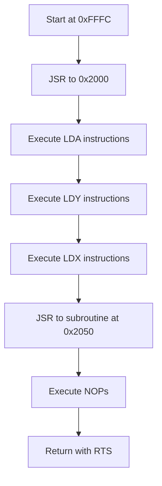

# Demo Programs

This document describes the demo programs included with the 6502 CPU emulator and explains how to use them for testing and learning purposes.

## Overview

The emulator includes several demo programs that showcase different features and instructions of the 6502 processor. These programs are defined using a memory map structure that associates memory addresses with byte vectors, allowing for sparse memory population.

## Memory Map Structure

Programs are defined using a C++ `std::map` structure:

```cpp
std::map<u32, std::vector<byte>> demo = {
    {0xFFFC, {op(Op::JSR), 0x00, 0x20}},
    {0x2000, {op(Op::LDA_IM), 0x42, /* more bytes... */}},
    // ...
};
```

This structure has several advantages:
- Efficiently represents sparse memory usage
- Clearly organizes code by memory region
- Allows direct placement of code and data at specific addresses

## Included Demo Programs

### 1. LDA Demo (`get_lda_demo()`)

This program demonstrates all addressing modes for the LDA (Load Accumulator) instruction:

| Memory Region | Purpose |
|---------------|---------|
| 0xFFFC        | Program entry point (JSR to main routine) |
| 0x2000        | Main routine with LDA instructions |
| Various addresses | Data for different addressing modes |

The program executes the following sequence:
1. JSR to 0x2000
2. LDA Immediate
3. LDA Zero Page
4. LDA Zero Page,X
5. LDA Absolute
6. LDA Absolute,X
7. LDA Absolute,Y
8. LDA (Indirect,X)
9. LDA (Indirect),Y
10. RTS (return from subroutine)

### 2. LDX Demo (`get_ldx_demo()`)

This demo showcases all addressing modes for the LDX (Load X Register) instruction:

| Memory Region | Purpose |
|---------------|---------|
| 0xFFFC        | Program entry point (JSR to main routine) |
| 0x2000        | Main routine with LDX instructions |
| Various addresses | Data for different addressing modes |

The program demonstrates:
- LDX Immediate
- LDX Zero Page
- LDX Zero Page,Y
- LDX Absolute
- LDX Absolute,Y

### 3. LDY Demo (`get_ldy_demo()`)

This demo showcases all addressing modes for the LDY (Load Y Register) instruction:

| Memory Region | Purpose |
|---------------|---------|
| 0xFFFC        | Program entry point (JSR to main routine) |
| 0x2000        | Main routine with LDY instructions |
| Various addresses | Data for different addressing modes |

The program demonstrates:
- LDY Immediate
- LDY Zero Page
- LDY Zero Page,X
- LDY Absolute
- LDY Absolute,X

### 4. Comprehensive Instruction Demo (`get_instruction_demo()`)

This is the most comprehensive demo, showcasing various instructions and addressing modes:



| Memory Region | Purpose |
|---------------|---------|
| 0xFFFC        | Program entry point (JSR to main routine) |
| 0x2000        | Main routine with various instructions |
| 0x2050        | Subroutine that loads 0xFF into accumulator |
| Various addresses | Data for different addressing modes |

## Memory Layout for Demo Programs

Each demo program carefully places data at specific memory locations to be accessed by the different addressing modes.

### Example: Indirect Addressing Data Layout

```
{0x0090, {0x00}},        // Zero page for indirect X
{0x0095, {0x00, 0x40}},  // Indirect address pointer after X offset (0x90+X where X=5)
{0x4000, {0xAA}},        // Target for Indirect,X

{0x0092, {0x30, 0x40}},  // Zero page for indirect Y
{0x4032, {0xBB}},        // Target for Indirect,Y (0x4030+Y where Y=2)
```

## Running Demo Programs

To run the demo programs, use the following steps:

1. Build the emulator:
   ```bash
   make setup
   make build
   ```

2. Run the emulator:
   ```bash
   make run
   ```

The default program in `main.cpp` is set to run the LDA demo, but you can modify it to run any of the other demos by uncommenting the appropriate sections.

## Execution Modes

The emulator supports two execution modes:

1. **Automatic execution**: Runs the program without interruption
2. **Manual stepping**: Allows you to step through instructions one by one

When running the emulator, you'll be prompted to choose an execution mode:
```
Please select the execution mode from below:
1. Automatic execution (default)
2. Manual stepping (press Enter to continue, 's' to see state, 'q' to quit)
Enter your choice (1 or 2):
```

## Visualizing Program Execution

During execution, the emulator will display:
- Current instruction address and opcode
- CPU registers and flags
- Execution status and cycles used

Example output:
```
0xFFFC: sp = 0x01ff  pc = 0xfffc  ins = 0x20 [JSR      ] [argument (next 2-bytes) = 0x2000]
```

After execution completes, you'll see the final CPU state:

```
┌─────────────── CPU STATE ───────────────────┐
| Execution COMPLETED using 23 cycles         │
├─────────────────────────────────────────────┤
│ PC (16-bit): 0xffff -- SP (8-bit): 0x01ff   │
├─────────────────────────────────────────────┤
│ A: 0xff (255)  X: 0xff (255)  Y: 0x44 ( 68) │
├────────────── STATUS FLAGS ─────────────────┤
│  N   V   U   B   D   I   Z   C              │
│  1   0   0   0   0   0   0   0              │
└─────────────────────────────────────────────┘
```

## Creating Custom Programs

You can create your own custom programs using the memory map structure:

```cpp
std::map<u32, std::vector<byte>> my_program = {
    // Reset vector points to program start
    {0xFFFC, {0x00, 0x80}},  // Little-endian: 0x8000

    // Program code at 0x8000
    {0x8000, {
        op(Op::LDA_IM), 0x42,  // Load 0x42 into accumulator
        op(Op::STA_ZP), 0x50,  // Store accumulator at zero page 0x50
        op(Op::RTS)            // Return from subroutine
    }}
};

// Load and execute the program
binary_reader::read_from_array(cpu, mem, my_program);
cpu.execute(100, mem);
```

## Related Documentation

- [CPU Implementation](CPU.md)
- [Instruction Set](OPCODES.md)
- [Memory Organization](MEMORY.md)
- [Architecture Overview](ARCHITECTURE.md)
