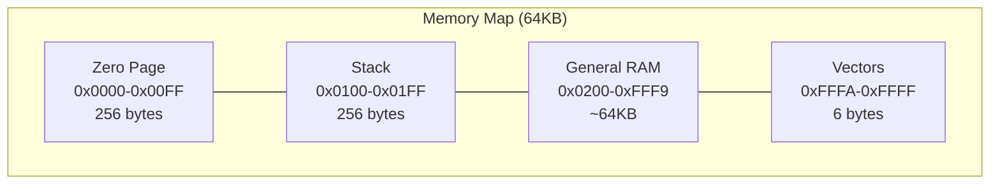
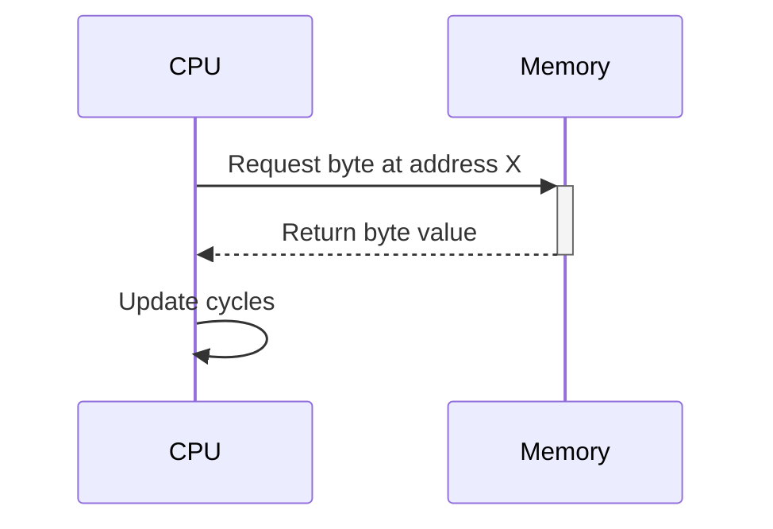
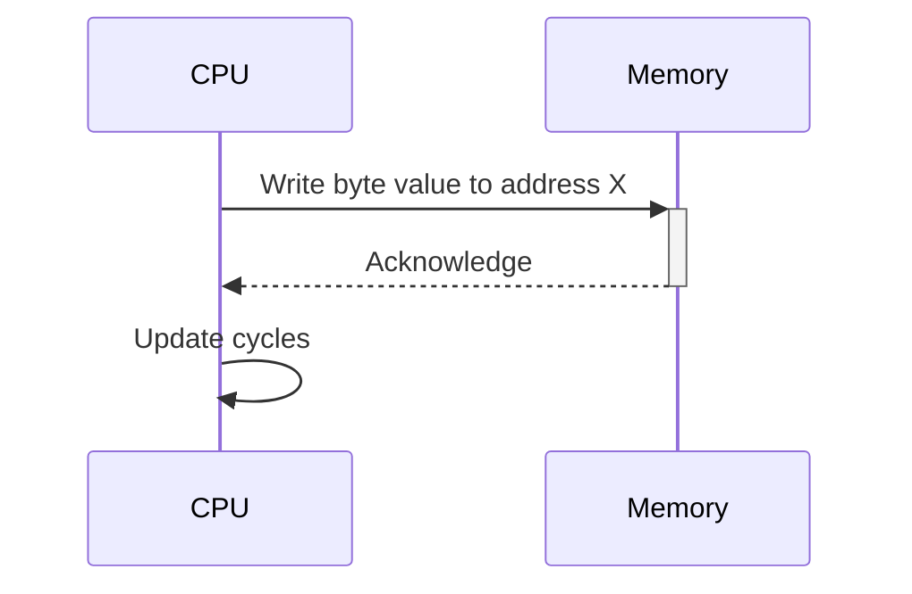
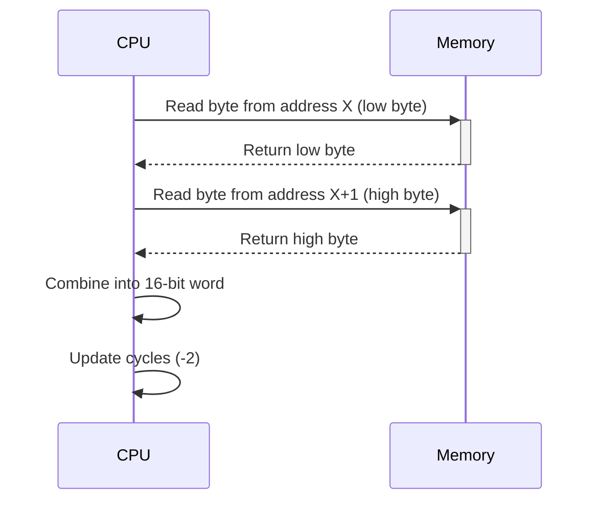

# Memory Implementation in 6502 CPU Emulator

The 6502 CPU uses a 16-bit address bus, allowing it to address 64KB of memory (0x0000 to 0xFFFF). This document describes the memory organization and implementation in our emulator.

## Memory Map Overview

The 6502 uses a flat memory model, but certain memory regions have special significance:



## Special Memory Regions

### Zero Page (0x0000-0x00FF)

The zero page is the first 256 bytes of memory. Instructions that operate on zero page addresses require only one byte for the address, making them faster and more compact than instructions using the full 16-bit addressing.

**Advantages:**
- Smaller instruction size (2 bytes vs 3 bytes)
- Faster execution (3 cycles vs 4 cycles)
- Special addressing modes available only for zero page

**Common uses:**
- Frequently accessed variables
- Pointers for indirect addressing

### Stack (0x0100-0x01FF)

The stack is a fixed 256-byte area in page 1 of memory. It's used for:
- Storing return addresses during subroutine calls
- Pushing/pulling data during PHP, PLA, and other stack instructions
- Storing processor status during interrupts

The stack grows downward in memory (from high to low addresses).

### Vectors (0xFFFA-0xFFFF)

The last 6 bytes of memory contain important vectors:

| Address | Vector | Description |
|---------|--------|-------------|
| 0xFFFA-0xFFFB | NMI | Non-maskable interrupt vector |
| 0xFFFC-0xFFFD | RESET | Reset vector - CPU starts execution from this address on reset |
| 0xFFFE-0xFFFF | IRQ/BRK | Interrupt request/Break instruction vector |

These vectors are 16-bit addresses stored in little-endian format (low byte first).

## Memory Implementation

In our emulator, memory is implemented as a simple array of bytes with methods for reading and writing:

```cpp
class Mem {
public:
    static constexpr u32 MAX_MEM = 1024 * 64;  // 64KB
    byte data[MAX_MEM];

    void init();
    void write_word(i32& cycles, word value, u32 address);
    byte operator[](u32 addr) const;
    byte& operator[](u32 addr);
};
```

### Key Methods

| Method | Description |
|--------|-------------|
| `init()` | Zeroes out all memory locations |
| `write_word()` | Writes a 16-bit word to memory in little-endian format |
| `operator[]` | Provides byte-level read/write access to memory |

### Little-Endian Format

The 6502 uses little-endian format for storing multi-byte values. This means the least significant byte is stored first (at the lower address).

Example: Storing the 16-bit value 0x1234 at address 0x2000
- Address 0x2000 contains 0x34 (low byte)
- Address 0x2001 contains 0x12 (high byte)

```cpp
// Writing a 16-bit word to memory
void Mem::write_word(i32& cycles, word value, u32 address) {
    data[address] = (value & 0xFF);    // Low byte first
    data[address + 1] = (value >> 8);  // High byte second
    cycles -= 2;
}
```

## Memory Access Patterns

Different instructions access memory in different ways:

### Reading a Byte



### Writing a Byte



### Reading a Word (16 bits)



## Memory Loading in the Emulator

Our emulator loads programs into memory using a map structure that associates memory addresses with byte vectors:

```cpp
std::map<u32, std::vector<byte>> demo = {
    {0xFFFC, {op(Op::JSR), 0x00, 0x20}},
    {0x2000, {op(Op::LDA_IM), 0x42, /* more bytes... */}},
    // ...
};
```

This structure allows for sparse memory population, which is particularly useful when programs only use specific parts of the memory.

## Demo Program Memory Usage

The demo programs in our emulator show examples of all addressing modes and memory access patterns. See [DEMO_PROGRAMS.md](DEMO_PROGRAMS.md) for detailed explanations of these programs.

## Memory-Related Debugging

The emulator includes memory debugging features:
- Memory dumps (first 64 bytes and last 64 bytes)
- GDB helpers for inspecting memory content
- Specific memory access logging

## Related Documentation

- [CPU Implementation](CPU.md)
- [Instruction Set and Opcodes](OPCODES.md)
- [Demo Programs](DEMO_PROGRAMS.md)
