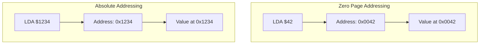
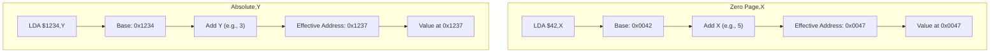

# 6502 CPU Instruction Set

This document provides detailed information about the 6502 CPU instruction set and addressing modes implemented in the emulator.

## Addressing Modes

The 6502 CPU supports a variety of addressing modes that determine how the CPU accesses operands. These addressing modes provide flexibility and efficiency in memory access patterns.

| Mode                 | Syntax  | Description                                                                      | Example       |
| -------------------- | ------- | -------------------------------------------------------------------------------- | ------------- |
| Implied/Implicit     | N/A     | The instruction itself implies the operand                                       | `RTS`         |
| Accumulator          | A       | The operation is performed on the accumulator                                    | `ASL A`       |
| Immediate            | #$nn    | The operand is the byte following the instruction                                | `LDA #$42`    |
| Zero Page            | $nn     | The operand is in the zero page (0x0000-0x00FF)                                  | `LDA $42`     |
| Zero Page,X          | $nn,X   | Zero page address offset by X register                                           | `LDA $42,X`   |
| Zero Page,Y          | $nn,Y   | Zero page address offset by Y register                                           | `LDX $42,Y`   |
| Absolute             | $nnnn   | The operand's full 16-bit address follows the instruction                        | `LDA $4242`   |
| Absolute,X           | $nnnn,X | Absolute address offset by X register                                            | `LDA $4242,X` |
| Absolute,Y           | $nnnn,Y | Absolute address offset by Y register                                            | `LDA $4242,Y` |
| Indirect             | ($nnnn) | The instruction specifies a memory location containing the 16-bit target address | `JMP ($4242)` |
| Indexed Indirect (X) | ($nn,X) | Zero-page address offset by X containing the 16-bit target address               | `LDA ($42,X)` |
| Indirect Indexed (Y) | ($nn),Y | Zero-page address contains a 16-bit address, which is then offset by Y           | `LDA ($42),Y` |
| Relative             | $nn     | Signed 8-bit offset from PC, used for branches                                   | `BNE $42`     |

## Memory Access Pattern Diagrams

### Zero Page vs. Absolute Addressing



### Indexed Addressing



### Indirect Addressing

```mermaid
graph TD
    subgraph "Indirect,X"
        IndXInst["LDA ($42,X)"] --> IndXBase["Base: 0x0042"]
        IndXBase --> IndXAdd["Add X (e.g., 5)"]
        IndXAdd --> IndXPtr["Pointer Address: 0x0047"]
        IndXPtr --> IndXRead["Read 16-bit Address from 0x0047"]
        IndXRead --> IndXAddr["Target Address (e.g., 0x5678)"]
        IndXAddr --> IndXValue["Value at 0x5678"]
    end

    subgraph "Indirect,Y"
        IndYInst["LDA ($42),Y"] --> IndYPtr["Pointer: 0x0042"]
        IndYPtr --> IndYRead["Read 16-bit Address from 0x0042"]
        IndYRead --> IndYBase["Base Address (e.g., 0x5678)"]
        IndYBase --> IndYAdd["Add Y (e.g., 3)"]
        IndYAdd --> IndYAddr["Target Address: 0x567B"]
        IndYAddr --> IndYValue["Value at 0x567B"]
    end

    subgraph "JMP Indirect"
        JMPInd["JMP ($1234)"] --> JMPIndPtr["Pointer: 0x1234"]
        JMPIndPtr --> JMPIndRead["Read 16-bit Address from 0x1234"]
        JMPIndRead --> JMPIndTarget["Jump to Address (e.g., 0xABCD)"]
        JMPIndPtr --> JMPIndBug["Note: Page boundary bug"]
        JMPIndBug --> JMPIndExample["Example: JMP ($12FF) reads from $12FF and $1200, not $12FF and $1300"]
    end
```



## Implemented Instructions

The 6502 CPU has 56 official instructions. Our emulator currently implements the following subset:

### Load/Store Operations

#### LDA (Load Accumulator)

| Opcode | Addressing Mode | Bytes | Cycles | Flags | Description                                    |
| ------ | --------------- | ----- | ------ | ----- | ---------------------------------------------- |
| 0xA9   | Immediate       | 2     | 2      | N,Z   | Load immediate value into accumulator          |
| 0xA5   | Zero Page       | 2     | 3      | N,Z   | Load accumulator from zero page address        |
| 0xB5   | Zero Page,X     | 2     | 4      | N,Z   | Load accumulator from zero page + X            |
| 0xAD   | Absolute        | 3     | 4      | N,Z   | Load accumulator from absolute address         |
| 0xBD   | Absolute,X      | 3     | 4+     | N,Z   | Load accumulator from absolute + X             |
| 0xB9   | Absolute,Y      | 3     | 4+     | N,Z   | Load accumulator from absolute + Y             |
| 0xA1   | (Indirect,X)    | 2     | 6      | N,Z   | Load accumulator from address in zero page + X |
| 0xB1   | (Indirect),Y    | 2     | 5+     | N,Z   | Load accumulator from address in zero page + Y |

#### LDX (Load X Register)

| Opcode | Addressing Mode | Bytes | Cycles | Flags | Description                            |
| ------ | --------------- | ----- | ------ | ----- | -------------------------------------- |
| 0xA2   | Immediate       | 2     | 2      | N,Z   | Load immediate value into X register   |
| 0xA6   | Zero Page       | 2     | 3      | N,Z   | Load X register from zero page address |
| 0xB6   | Zero Page,Y     | 2     | 4      | N,Z   | Load X register from zero page + Y     |
| 0xAE   | Absolute        | 3     | 4      | N,Z   | Load X register from absolute address  |
| 0xBE   | Absolute,Y      | 3     | 4+     | N,Z   | Load X register from absolute + Y      |

#### LDY (Load Y Register)

| Opcode | Addressing Mode | Bytes | Cycles | Flags | Description                            |
| ------ | --------------- | ----- | ------ | ----- | -------------------------------------- |
| 0xA0   | Immediate       | 2     | 2      | N,Z   | Load immediate value into Y register   |
| 0xA4   | Zero Page       | 2     | 3      | N,Z   | Load Y register from zero page address |
| 0xB4   | Zero Page,X     | 2     | 4      | N,Z   | Load Y register from zero page + X     |
| 0xAC   | Absolute        | 3     | 4      | N,Z   | Load Y register from absolute address  |
| 0xBC   | Absolute,X      | 3     | 4+     | N,Z   | Load Y register from absolute + X      |

#### STA (Store Accumulator)

| Opcode | Addressing Mode | Bytes | Cycles | Flags | Description                                     |
| ------ | --------------- | ----- | ------ | ----- | ----------------------------------------------- |
| 0x85   | Zero Page       | 2     | 3      | -     | Store accumulator in zero page address          |
| 0x95   | Zero Page,X     | 2     | 4      | -     | Store accumulator in zero page + X              |
| 0x8D   | Absolute        | 3     | 4      | -     | Store accumulator in absolute address           |
| 0x9D   | Absolute,X      | 3     | 5      | -     | Store accumulator in absolute + X               |
| 0x99   | Absolute,Y      | 3     | 5      | -     | Store accumulator in absolute + Y               |
| 0x81   | (Indirect,X)    | 2     | 6      | -     | Store accumulator in address from zero page + X |
| 0x91   | (Indirect),Y    | 2     | 6      | -     | Store accumulator in address from zero page + Y |

#### STX (Store X Register)

| Opcode | Addressing Mode | Bytes | Cycles | Flags | Description                           |
| ------ | --------------- | ----- | ------ | ----- | ------------------------------------- |
| 0x86   | Zero Page       | 2     | 3      | -     | Store X register in zero page address |
| 0x96   | Zero Page,Y     | 2     | 4      | -     | Store X register in zero page + Y     |
| 0x8E   | Absolute        | 3     | 4      | -     | Store X register in absolute address  |

#### STY (Store Y Register)

| Opcode | Addressing Mode | Bytes | Cycles | Flags | Description                           |
| ------ | --------------- | ----- | ------ | ----- | ------------------------------------- |
| 0x84   | Zero Page       | 2     | 3      | -     | Store Y register in zero page address |
| 0x94   | Zero Page,X     | 2     | 4      | -     | Store Y register in zero page + X     |
| 0x8C   | Absolute        | 3     | 4      | -     | Store Y register in absolute address  |

### Control Flow

#### JSR (Jump to Subroutine)

| Opcode | Addressing Mode | Bytes | Cycles | Flags | Description                                                    |
| ------ | --------------- | ----- | ------ | ----- | -------------------------------------------------------------- |
| 0x20   | Absolute        | 3     | 6      | -     | Push return address (PC-1) to stack and jump to target address |

#### RTS (Return from Subroutine)

| Opcode | Addressing Mode | Bytes | Cycles | Flags | Description                                               |
| ------ | --------------- | ----- | ------ | ----- | --------------------------------------------------------- |
| 0x60   | Implied         | 1     | 6      | -     | Pull return address from stack, increment, and jump to it |

#### JMP (Jump)

| Opcode | Addressing Mode | Bytes | Cycles | Flags | Description                                                                                  |
| ------ | --------------- | ----- | ------ | ----- | -------------------------------------------------------------------------------------------- |
| 0x4C   | Absolute        | 3     | 3      | -     | Jump to a new location specified by the 16-bit address                                       |
| 0x6C   | Indirect        | 3     | 5      | -     | Jump to the address contained at the specified memory location (with 6502 page boundary bug) |

#### NOP (No Operation)

| Opcode | Addressing Mode | Bytes | Cycles | Flags | Description  |
| ------ | --------------- | ----- | ------ | ----- | ------------ |
| 0xEA   | Implied         | 1     | 2      | -     | No operation |

### Stack Operations

#### PHA (Push Accumulator)

| Opcode | Addressing Mode | Bytes | Cycles | Flags | Description                                      |
| ------ | --------------- | ----- | ------ | ----- | ------------------------------------------------ |
| 0x48   | Implied         | 1     | 3      | -     | Push the value in the accumulator onto the stack |

#### PHP (Push Processor Status)

| Opcode | Addressing Mode | Bytes | Cycles | Flags | Description                                                                   |
| ------ | --------------- | ----- | ------ | ----- | ----------------------------------------------------------------------------- |
| 0x08   | Implied         | 1     | 3      | -     | Push the processor status register onto the stack (with B flag and bit 5 set) |

#### PLA (Pull Accumulator)

| Opcode | Addressing Mode | Bytes | Cycles | Flags | Description                                      |
| ------ | --------------- | ----- | ------ | ----- | ------------------------------------------------ |
| 0x68   | Implied         | 1     | 4      | N,Z   | Pull a value from the stack into the accumulator |

#### PLP (Pull Processor Status)

| Opcode | Addressing Mode | Bytes | Cycles | Flags | Description                                                                        |
| ------ | --------------- | ----- | ------ | ----- | ---------------------------------------------------------------------------------- |
| 0x28   | Implied         | 1     | 4      | All   | Pull a value from the stack into the processor status register (B flag unaffected) |

#### TXS (Transfer X to Stack Pointer)

| Opcode | Addressing Mode | Bytes | Cycles | Flags | Description                                               |
| ------ | --------------- | ----- | ------ | ----- | --------------------------------------------------------- |
| 0x9A   | Implied         | 1     | 2      | -     | Transfer the value in the X register to the stack pointer |

#### TSX (Transfer Stack Pointer to X)

| Opcode | Addressing Mode | Bytes | Cycles | Flags | Description                                               |
| ------ | --------------- | ----- | ------ | ----- | --------------------------------------------------------- |
| 0xBA   | Implied         | 1     | 2      | N,Z   | Transfer the value in the stack pointer to the X register |

## Cycle Notation

In the cycle count column:

- A plain number (e.g., 4) indicates the instruction always takes that many cycles
- A number with a "+" (e.g., 4+) indicates the instruction takes one extra cycle when crossing a page boundary

## Implementation Details

Each instruction is implemented as a function in our emulator with the following pattern:

```cpp
void INSTRUCTION_ADDRESSINGMODE(Cpu& cpu, i32& cycles, Mem& mem) {
    // Fetch operands based on addressing mode
    // Perform the operation
    // Update flags as needed
    // Decrement cycles
}
```

For example, the implementation of LDA with immediate addressing:

```cpp
void LDA_IM(Cpu& cpu, i32& cycles, Mem& mem) {
    byte value = cpu.fetch_byte(cycles, mem);
    cpu.set(Register::A, value);
    // Set flags based on loaded value
    cpu.Z = (cpu.A == 0);
    cpu.N = (cpu.A & 0b10000000) > 0;
}
```

### Notable Implementation Details

#### JMP Indirect Page Boundary Bug

The 6502 has a well-known hardware bug in the JMP indirect instruction. When the indirect address falls on a page boundary (e.g., $xxFF, where xx is any page), the processor incorrectly fetches the high byte from $xx00 (the start of the same page) rather than $xx+1+00 (the start of the next page).

For example:

- If executing `JMP ($10FF)`
- The CPU reads the low byte from $10FF correctly
- But reads the high byte from $1000 (not $1100)

Our emulator accurately replicates this bug:

```cpp
void JMP_IND(Cpu& cpu, i32& cycles, Mem& mem) {
    word address = cpu.fetch_word(cycles, mem);

    // Emulate the 6502 page boundary bug
    word fetch_address;
    if ((address & 0x00FF) == 0xFF) {  // Page boundary case (e.g. $xxFF)
        byte low_byte = mem.read(address, cycles);
        byte high_byte = mem.read(address & 0xFF00, cycles);  // Wrap within the same page
        fetch_address = static_cast<word>(low_byte) | (static_cast<word>(high_byte) << 8);
    } else {
        fetch_address = mem.read_word(address, cycles);
    }

    cpu.PC = fetch_address;
}
```

#### Stack Operations

Stack operations manipulate the hardware stack located at $0100-$01FF:

```cpp
void PHA(Cpu& cpu, i32& cycles, Mem& mem) {
    // Push accumulator onto stack
    mem.write(0x0100 + cpu.SP, cpu.A, cycles);
    cpu.SP--;
    cycles--;
}

void PHP(Cpu& cpu, i32& cycles, Mem& mem) {
    // Push processor status with B flag and bit 5 set
    byte status = cpu.get_status() | 0x30;  // Set B flag and bit 5
    mem.write(0x0100 + cpu.SP, status, cycles);
    cpu.SP--;
    cycles--;
}
```

## Related Documentation

- [CPU Implementation](CPU.md)
- [Memory Organization](MEMORY.md)
- [Demo Programs](DEMO_PROGRAMS.md)
