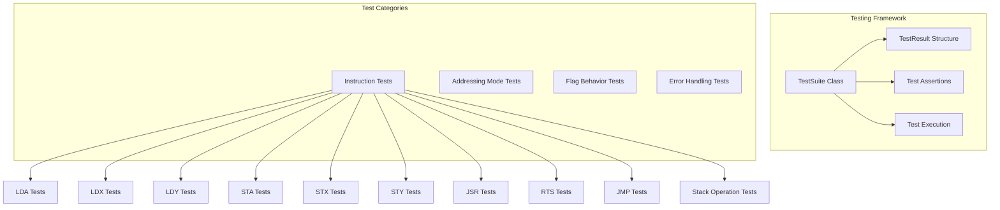

# Testing Framework

This document explains the testing framework used in the 6502 CPU emulator project and provides guidance on writing and running tests.

## Overview

The 6502 CPU emulator includes a comprehensive testing framework to validate the correctness of the CPU implementation. Tests are organized by instruction type and addressing mode, ensuring thorough coverage of the emulator's functionality.

## Testing Architecture



## Test Suite Components

### TestResult Structure

The `TestResult` structure stores the outcome of each test:

```cpp
struct TestResult {
    std::string name;
    bool passed;
    std::string message;
};
```

### TestSuite Class

The `TestSuite` class manages test execution and reporting:

```cpp
class TestSuite {
private:
    std::vector<TestResult> results;
    std::string suite_name;
    int passed_count = 0;
    int failed_count = 0;

public:
    TestSuite(const std::string& name);
    void register_test(const std::string& name, Func test_func);
    void add_result(const TestResult& result);
    void print_results() const;
    // Other methods...
};
```

### Test Exception

The framework uses exceptions to signal test failures:

```cpp
class TestFailedException : public std::exception {
private:
    std::string message;
    std::string colored_message;

public:
    TestFailedException(const std::string& msg);
    const char* what() const noexcept override;
};
```

## Available Tests

The project includes tests for the following instructions and addressing modes:

### LDA (Load Accumulator) Tests

| Test                       | Description                                 |
| -------------------------- | ------------------------------------------- |
| `inline_lda_test`          | Tests LDA immediate mode                    |
| `inline_lda_zp_test`       | Tests LDA zero page mode                    |
| `inline_lda_zpx_test`      | Tests LDA zero page,X mode                  |
| `inline_lda_zpx_wrap_test` | Tests LDA zero page,X with address wrapping |
| `inline_lda_absolute_test` | Tests LDA absolute mode                     |
| `inline_lda_absx_test`     | Tests LDA absolute,X mode                   |
| `inline_lda_absy_test`     | Tests LDA absolute,Y mode                   |
| `inline_lda_indx_test`     | Tests LDA (indirect,X) mode                 |
| `inline_lda_indy_test`     | Tests LDA (indirect),Y mode                 |

### LDX (Load X Register) Tests

| Test                       | Description                                 |
| -------------------------- | ------------------------------------------- |
| `inline_ldx_test`          | Tests LDX immediate mode                    |
| `inline_ldx_zp_test`       | Tests LDX zero page mode                    |
| `inline_ldx_zpy_test`      | Tests LDX zero page,Y mode                  |
| `inline_ldx_zpy_wrap_test` | Tests LDX zero page,Y with address wrapping |
| `inline_ldx_absolute_test` | Tests LDX absolute mode                     |
| `inline_ldx_absy_test`     | Tests LDX absolute,Y mode                   |

### LDY (Load Y Register) Tests

| Test                       | Description                                 |
| -------------------------- | ------------------------------------------- |
| `inline_ldy_test`          | Tests LDY immediate mode                    |
| `inline_ldy_zp_test`       | Tests LDY zero page mode                    |
| `inline_ldy_zpx_test`      | Tests LDY zero page,X mode                  |
| `inline_ldy_zpx_wrap_test` | Tests LDY zero page,X with address wrapping |
| `inline_ldy_absolute_test` | Tests LDY absolute mode                     |
| `inline_ldy_absx_test`     | Tests LDY absolute,X mode                   |

### STA (Store Accumulator) Tests

| Test                       | Description                                 |
| -------------------------- | ------------------------------------------- |
| `inline_sta_zp_test`       | Tests STA zero page mode                    |
| `inline_sta_zpx_test`      | Tests STA zero page,X mode                  |
| `inline_sta_zpx_wrap_test` | Tests STA zero page,X with address wrapping |
| `inline_sta_absolute_test` | Tests STA absolute mode                     |
| `inline_sta_absx_test`     | Tests STA absolute,X mode                   |
| `inline_sta_absy_test`     | Tests STA absolute,Y mode                   |
| `inline_sta_indx_test`     | Tests STA (indirect,X) mode                 |
| `inline_sta_indy_test`     | Tests STA (indirect),Y mode                 |

### STX (Store X Register) Tests

| Test                       | Description                                 |
| -------------------------- | ------------------------------------------- |
| `inline_stx_zp_test`       | Tests STX zero page mode                    |
| `inline_stx_zpy_test`      | Tests STX zero page,Y mode                  |
| `inline_stx_zpy_wrap_test` | Tests STX zero page,Y with address wrapping |
| `inline_stx_absolute_test` | Tests STX absolute mode                     |

### STY (Store Y Register) Tests

| Test                       | Description                                 |
| -------------------------- | ------------------------------------------- |
| `inline_sty_zp_test`       | Tests STY zero page mode                    |
| `inline_sty_zpx_test`      | Tests STY zero page,X mode                  |
| `inline_sty_zpx_wrap_test` | Tests STY zero page,X with address wrapping |
| `inline_sty_absolute_test` | Tests STY absolute mode                     |

### Control Flow Tests

| Test                           | Description                          |
| ------------------------------ | ------------------------------------ |
| `inline_jsr_rts_test`          | Tests JSR and RTS instructions       |
| `inline_jmp_absolute_test`     | Tests JMP absolute instruction       |
| `inline_jmp_indirect_test`     | Tests JMP indirect instruction       |
| `inline_jmp_indirect_bug_test` | Tests JMP indirect page boundary bug |
| `inline_invalid_opcode_test`   | Tests handling of invalid opcodes    |

### Stack Operation Tests

| Test                           | Description                                                       |
| ------------------------------ | ----------------------------------------------------------------- |
| `inline_pha_pla_test`          | Tests PHA (Push Accumulator) and PLA (Pull Accumulator)           |
| `inline_php_plp_test`          | Tests PHP (Push Processor Status) and PLP (Pull Processor Status) |
| `inline_txs_test`              | Tests TXS (Transfer X to Stack Pointer)                           |
| `inline_tsx_test`              | Tests TSX (Transfer Stack Pointer to X)                           |
| `inline_stack_operations_test` | Tests combined stack operations                                   |

## Running Tests

To run all tests:

```bash
make test
```

This will:

1. Configure the build system with testing enabled
2. Build the test executable
3. Run all tests and display the results

## Test Output

The test output is color-coded for easy interpretation:

```
===== Running LDA Op Code Tests =====

======================================
TEST SUITE: LDA Op Code
======================================
✅ PASS: Inline LDA Test
✅ PASS: Inline LDA ZP Test
✅ PASS: Inline LDA ZPX Test
✅ PASS: Inline LDA ZPX (Wrapping) Test
✅ PASS: Inline LDA Absolute Test
✅ PASS: Inline LDA ABSX Test
✅ PASS: Inline LDA ABSY Test
✅ PASS: Inline LDA INDX Test
✅ PASS: Inline LDA INDY Test
--------------------------------------
SUMMARY: 9 passed, 0 failed
======================================
```

## Writing New Tests

To write a new test:

1. Create a test function in the appropriate test file:

```cpp
void inline_my_new_test(Cpu& cpu, Mem& mem) {
    cpu.reset(mem);

    // Set up memory with instructions
    mem[0xFFFC] = op(Op::MY_INSTRUCTION);
    mem[0xFFFD] = 0x42;  // Operand

    // Execute the instruction
    bool program_completed = false;
    i32 cycles_used = cpu.execute(expected_cycles, mem, &program_completed, true);

    // Verify results with assertions
    if (cpu.get(Register::A) != expected_value) {
        throw testing::TestFailedException("Test failed: Unexpected value in accumulator");
    }

    // Verify flags
    if (cpu.Z != expected_z_flag) {
        throw testing::TestFailedException("Test failed: Incorrect Z flag state");
    }
}
```

2. Register the test in the appropriate test suite:

```cpp
test_suite.register_test("My New Test", [&]() { inline_my_new_test(cpu, mem); });
```

## Test Coverage

The current test suite covers:

- Instruction functionality
- Addressing modes
- Flag behavior
- Error handling
- Edge cases (e.g., page boundary crossing, address wrapping)
- Hardware quirks (e.g., JMP indirect page boundary bug)
- Stack operations

## Debugging Tests

When a test fails, detailed information is provided:

1. The test name
2. The expected vs. actual values
3. Register state at failure

You can also use the GDB debugging helpers defined in `.gdbinit` to inspect CPU and memory state during test execution.

## Related Documentation

- [CPU Implementation](CPU.md)
- [Instruction Set](OPCODES.md)
- [Demo Programs](DEMO_PROGRAMS.md)
- [Architecture Overview](ARCHITECTURE.md)
